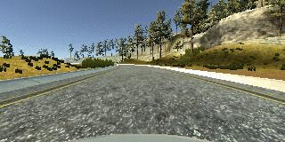
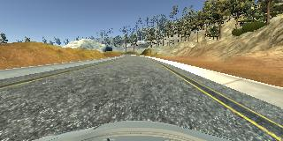
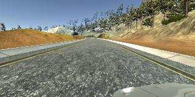
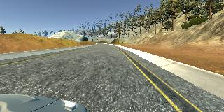
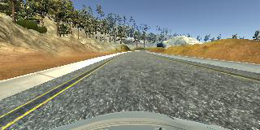
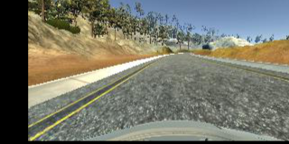

#**Behavioral Cloning**

This project is Udacity [Self-Driving Car Nanodegree] (https://www.udacity.com/drive). The goal of the project is to complete all the track provided by the simulator, and the code written by it satisfies this. The structure of the used DNN was VGG16, and the acquired data was used the training mode of the simulator. For the simulator provided by Udacity, see [section](https://github.com/udacity/self-driving-car-sim). The data used here was obtained directly using the ps4 controller.

The model runs as shown below.

Track 1                       |  Track 2
:----------------------------:|:------------------------------:
 | 
|[YouTube Link](https://youtu.be/j5FRHlkMdpM)|[YouTube Link](https://youtu.be/MDbgBqUcmnE)|

###Dependencies

This project used requires **Python 3.5** and using below libraries: 

- [TensorFlow](http://tensorflow.org)
- [Keras](https://keras.io/)
- [pandas](http://pandas.pydata.org/)
- [NumPy](http://www.numpy.org/)
- [scikit-learn](http://scikit-learn.org/)
- [opencv](http://opencv.org/)

Drive.py only need below libraries:

- [flask-socketio](https://flask-socketio.readthedocs.io/en/latest/)
- [eventlet](http://eventlet.net/)
- [pillow](https://python-pillow.org/)

###Quick Start

- Install python libraries:

You need a [anaconda](https://www.continuum.io/downloads)
Next we need to install Tensorflow and Keras.

```Tensorflow
$ pip install tensorflow
if use GPU:
$ pip install tensorflow-gpu
```
```Keras
$ sudo pip install keras
```
```opencv
$ conda install -c https://conda.binstar.org/menpo opencv
```

- Learning the model
```python
python model.py
```

- Run the trained model
```python
python drive.py modelxxx.h5
```

###DNN Architecture

The structure of DNN uses VGG16, which is based on newly introduced ones (eg faster R-CNN, Segnet, Single Shot Detector, etc.).

In this project, it seems more advantageous to use a relatively simple NVIDIA model. reason for this is that it is important to pre-process the acquired data and match the center image with the images on both sides. VGG16 takes longer learning time because there are more hidden layers.
Despite these reasons, i chose to use VGG16 because it is the base for many different models. many other models are using the VGG16 pre-training set.

Details of the model used are described below.

|Layer (type)                    |Output Shape        |Param       |Connected to      |                     
|--------------------------------|--------------------|-----------:|------------------|
|lambda_1 (Lambda)               |(None, 64, 64, 3)   |0           |lambda_input_1    |       
|conv_in (Convolution2D)         |(None, 64, 64, 3)   |12          |lambda_1          |         
|conv_1 (Convolution2D)          |(None, 64, 64, 64)  |1792        |conv_in           |               
|conv_2 (Convolution2D)          |(None, 64, 64, 64)  |36928       |conv_1            |               
|pool_1 (MaxPooling2D)           |(None, 32, 32, 64)  |0           |conv_2            |         
|conv_3 (Convolution2D)          |(None, 32, 32, 128) |73856       |pool_1            |         
|conv_4 (Convolution2D)          |(None, 32, 32, 128) |147584      |conv_3            |         
|pool_2 (MaxPooling2D)           |(None, 16, 16, 128) |0           |conv_4            |        
|conv_5 (Convolution2D)          |(None, 16, 16, 256) |295168      |pool_2            |         
|conv_6 (Convolution2D)          |(None, 16, 16, 256) |590080      |conv_5            |         
|conv_7 (Convolution2D)          |(None, 16, 16, 256) |590080      |conv_6            |         
|pool_3 (MaxPooling2D)           |(None, 8, 8, 256)   |0           |conv_7            |         
|conv_8 (Convolution2D)          |(None, 8, 8, 512)   |1180160     |pool_3            |                     
|conv_9 (Convolution2D)          |(None, 8, 8, 512)   |2359808     |conv_8            |                     
|conv_10 (Convolution2D)         |(None, 8, 8, 512)   |2359808     |conv_9            |                     
|pool_4 (MaxPooling2D)           |(None, 4, 4, 512)   |0           |conv_10           |               
|conv_11 (Convolution2D)         |(None, 4, 4, 512)   |2359808     |pool_4            |                     
|conv_12 (Convolution2D)         |(None, 4, 4, 512)   |2359808     |conv_11           |                    
|conv_13 (Convolution2D)         |(None, 4, 4, 512)   |2359808     |conv_12           |                    
|pool_5 (MaxPooling2D)           |(None, 2, 2, 512)   |0           |conv_13           |
|Flatten (Flatten)               |(None, 2048)        |0           |pool_5            |              
|fc1 (Dense)                     |(None, 512)         |1049088     |Flatten           |         
|fc1_dropout (Dropout)           |(None, 512)         |0           |fc1               |         
|fc2 (Dense)                     |(None, 256)         |131328      |fc1_dropout       |                
|fc2_dropout (Dropout)           |(None, 256)         |0           |fc2               |               
|fc3 (Dense)                     |(None, 64)          |16448       |fc2_dropout       |                
|fc3_dropout (Dropout)           |(None, 64)          |0           |fc3               |                       
|fc4 (Dense)                     |(None, 32)          |2080        |fc3_dropout       |                
|fc4_dropout (Dropout)           |(None, 32)          |0           |fc4               |                        
|                                |**Total params**    |15,913,677

###Example of augumented and processing images

**Center Image**



**Left Image**



**Right Image**



**Flipped Image**



**Translated Image**



**Pre-processing Image**


###Image Preprocessing

Since only the road portion of the car is needed for learning, the image is cropped and used.
The model is adjusted to 64x64 and transforms the color space of the image to make the gradient work better.

###Image Augumentation

Select one of the three images center, right, left for learning data, and adjust the steering angle to the steering angle associated with the left or right image to 0.25. Because the model will be out of the center as time passes, you can create an offset value to create and recover non-zero errors.

Advantage of learning both images near the road is to learn that recover from the roadside back to the center, resulting in smoother steering.

###Reflection
Track 2 did not work well, so i tested both the VGG16 and nvida structures and obtained a lot of data. i used the VGG16 and passed it while keeping the vehicle speed at 15 mph. generated pre-training data tend to overfit, and it is necessary to confirm whether the data is the problem. also, i think that the problem of steering shaking can be solved through simple filters.

###Refernces
- NVIDIA model: https://devblogs.nvidia.com/parallelforall/deep-learning-self-driving-cars/
- Comma.ai model: https://github.com/commaai/research
- Recovering idea: https://medium.com/@mohankarthik/cloning-a-car-to-mimic-human-driving-5c2f7e8d8aff#.y50qf6ltd
